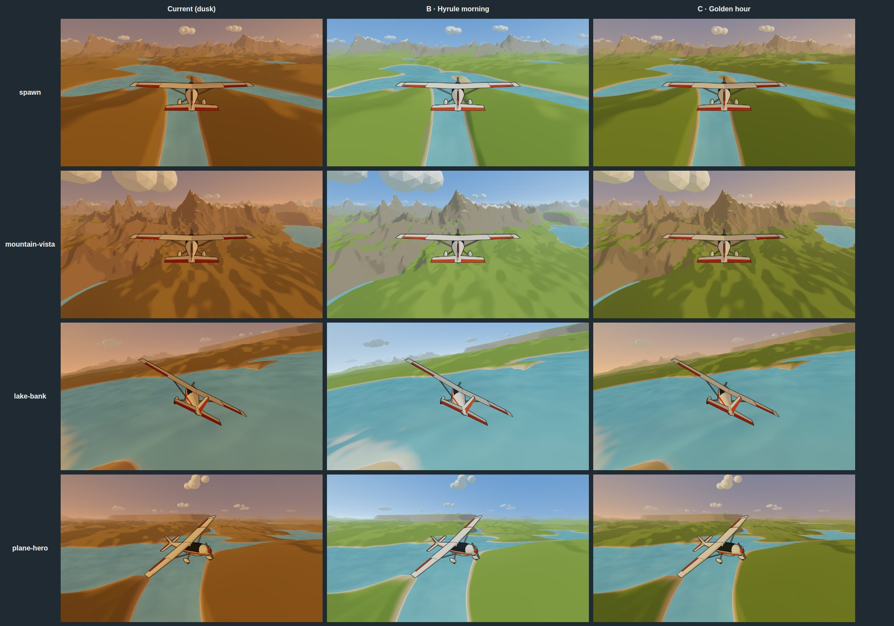
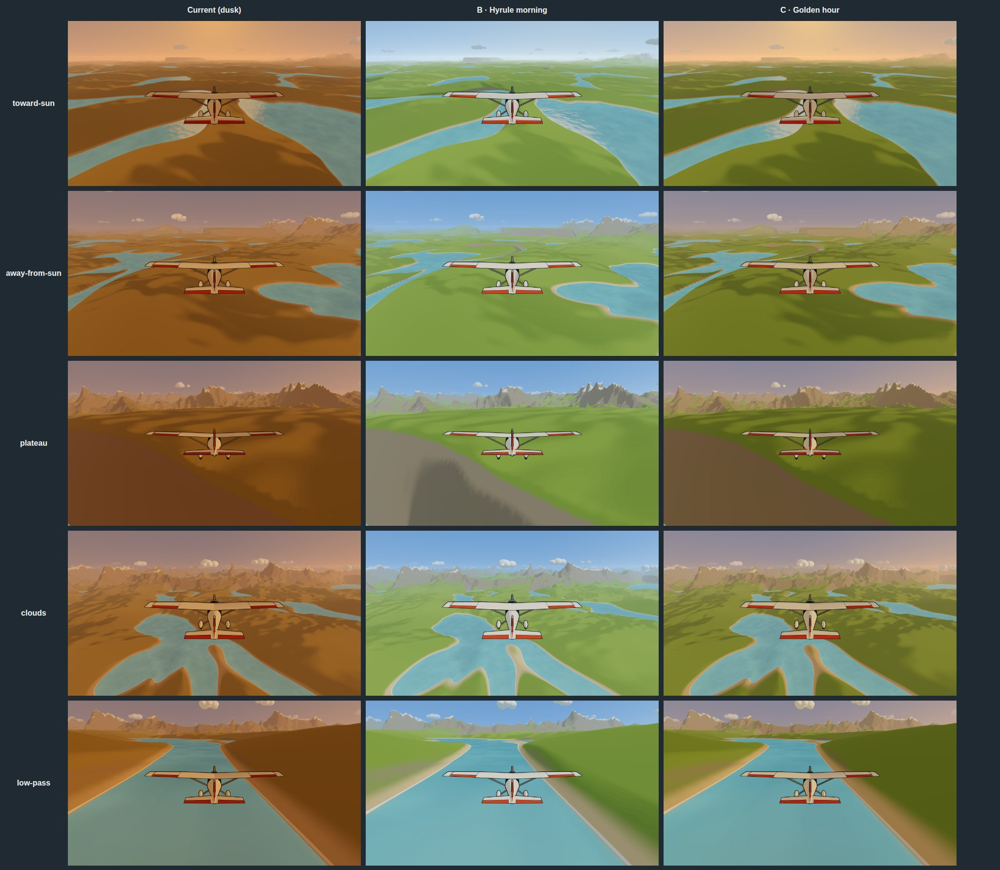

# Driftwing art bible

The visual brief for the AAA polish pass. It replaces the palette section of
`docs/art-direction.md` (that file's type, spacing and contrast rules still
stand).

**Status: palette B, Hyrule morning, is the default.** The owner picked it on
2026-09-26 (#88). Golden hour stays as a preset, and a full day cycle driven
by an in-game clock is a follow-up (#92, #94, §4).

The target is *The Legend of Zelda: Breath of the Wild* seen from the air. The
test for every frame: would it hold up next to a BotW screenshot at thumbnail
size on a portfolio page, and can a player read the plane, the horizon and one
prompt from a couch three metres from a 55" TV.

## 1. Mood board, in words

**Great Plateau at dawn.** Low gold light rakes across dewy grass. Long, soft,
sky-tinted shadows. Mist pools in the valleys and thins upward into a sky that
is peach at the horizon and clear cerulean overhead. The Temple of Time and the
far ring of mountains are flat, blue-grey cutouts stacked in aerial
perspective. Nothing is hard-edged except the silhouettes.

**Hyrule Field at mid-morning.** The canonical look. Grass is a fresh
yellow-green, never lime and never olive, broken into big painterly patches by
light and by taller clumps. Round trees with two or three canopy lumps, dark
green with a paler lit cap. Rocks are grey-beige with horizontal strata, lighter
on top. Tall cumulus with bright cream tops and soft lavender-grey undersides;
they have volume and stepped shading, but their edges stay soft. Ambient life
everywhere: birds, wind in the grass, a horse in the distance.

**Lanayru.** Water that is genuinely blue, not teal-grey. Waterfalls as vertical
white ribbons visible from far away. Reeds and wetland greens with more blue in
them. This is where the water tokens come from.

**Tabantha.** Big sky, cool light, stratified cliffs and a bridge you spot from
kilometres out. The sense of scale comes from tiny landmarks below a huge
horizon. This is the flying fantasy: the Rito Village approach on a paraglider
is the exact feeling Driftwing is chasing.

**Why the current build reads as desert.** The screenshots in
`docs/screenshots/` show one hue family from ground to sky. `grass-light`
`#b7a35e` and `grass-shadow` `#6d5a3a` are sand and umber; the sky horizon
`#e7a878` and the haze `#e3bd9a` sit in the same orange band; the sun light is
gold on top of that. Every layer collapses into one value range, so at TV
distance nothing separates. BotW at golden hour still has green grass and blue
shadows. Warm light on cool ground is the whole trick.

## 2. Value and saturation targets per layer

Values are approximate CIE L* (0 black, 100 white) and HSL saturation, for the
final pixel after lighting and haze, in the default preset. The rule of thumb
is BotW's: the sky is the brightest layer, distance lifts value and drops
saturation toward the sky, the near ground is mid-value and moderately
saturated, and the plane is the highest local contrast on screen.

| Layer | L* | Saturation | Notes |
|---|---|---|---|
| Sky zenith | 50–58 | 55–65% | Clear cerulean. Never violet, never grey. |
| Sky horizon | 88–92 | 15–25% | Milky pale blue. Warm only toward the sun. |
| Clouds, lit top | 94–97 | < 8% | Cream white, the brightest thing besides the sun. |
| Clouds, underside | 72–80 | 10–15% | Lavender-grey, lit from the sky. |
| Far terrain (6–10 km) | within 6 of horizon | < 15% | Fully hazed: it is the sky. |
| Mid terrain (1–6 km) | 65–78 | 20–35% | Blue-shifted, flattened, no shadow detail. |
| Near terrain, lit (0–1 km) | 58–68 | 40–55% | Grass and rock read as themselves. |
| Near terrain, shadow | 40–50 | 35–45% | Sky-tinted, never below L* 35, never brown. |
| Water | 55–70 | 40–55% | Bluer than the sky at the horizon. |
| Plane body | 92–95 | < 10% | Warm cream. |
| Plane stripe | 55–60 | 70–80% | The one saturated warm accent in the world. |
| UI text | 95+ | < 10% | On a soft dark glow, never a panel. |

Contrast rules that follow from the table:

- Plane against ground or sky: at least 3:1 in luminance at any altitude. The
  cream body does that against green and blue; the stripe carries it against
  cloud tops.
- Horizon line is always readable: the far-terrain band and the horizon sky
  differ by at least 6 L* until the haze finishes them.
- HUD text: WCAG AA (4.5:1) against the worst-case backdrop behind it, tested
  in `tokens.test.ts` as today.

## 3. Palette proposal

Two changes to the token model, then the values.

1. **Albedo and light are separate.** Ground, water, foliage and plane tokens
   are albedo (what the thing is). Sky, sun, haze and ambient tokens are
   lighting (what time it is). A time-of-day preset swaps only the lighting
   group, so the grass is the same grass at dawn and at noon.
2. **The shadow side is lit by the sky.** The hemisphere light and the toon
   ramp's shadow band both take the zenith colour, so shadows go cool, not
   brown. That is what makes green read as green under gold light.

### Albedo tokens (constant across presets)

| Token | Proposed | Current | Role |
|---|---|---|---|
| `grass-light` | `#93b352` | `#b7a35e` | Lit grass, fresh yellow-green |
| `grass-shadow` | `#567c3b` | `#6d5a3a` | Grass shadow face and tall clumps |
| `sand` | `#d9c89c` | `#cdb48a` | Waterline band, pale |
| `rock` | `#9b9486` | `#a3907b` | Cliffs, warm grey |
| `rock-shadow` | `#6e685e` | new | Strata and the shadow face of rock |
| `snow` | `#f5f6f8` | `#f6ead9` | Cool white |
| `water-shallow` | `#6fc0c8` | `#7fa79c` | Lanayru blue-teal |
| `water-deep` | `#2f6d8c` | `#39525a` | Deep blue |
| `foliage` | `#3f7d46` | `#5f6b41` | Tree canopy |
| `foliage-light` | `#6da356` | new | Canopy lit cap, bush tops |
| `bark` | `#6b5442` | new | Trunks and branches |
| `outline` | `#1f2a33` | `#2a2219` | Cool near-black, matches the blue shadows |
| `plane-body` | `#f4efe3` | `#f1e7d4` | Cream |
| `plane-stripe` | `#d8562b` | `#c2572f` | Saturated terracotta, pops on green and blue |
| `plane-metal` | `#9c948a` | `#a99b89` | Struts, gear |
| `plane-glass` | `#35414d` | `#3a4248` | Canopy band, tyres |

### Lighting tokens, preset `morning` (proposed default)

| Token | Value | Role |
|---|---|---|
| `sky-zenith` | `#3f7fc4` | Cerulean |
| `sky-horizon` | `#d5e6f0` | Pale milky blue |
| `sky-sun-glow` | `#ffe6bd` | Warm halo around the sun only |
| `fog` | `#bfd3e2` | Aerial perspective, cool |
| `sun` | `#fff2d2` | Key light, near white |
| `ambient-sky` | `#8fb4de` | Hemisphere top / shadow fill |
| `ambient-ground` | `#6b7a52` | Hemisphere bottom |
| `cloud-top` | `#fbfaf5` | |
| `cloud-shade` | `#b9c3d6` | |
| `sun-direction` | `[0.55, 0.62, 0.45]` | ~38° elevation, front-left of spawn |

### Lighting tokens, preset `golden-hour`

The current mood, kept as a preset (`?tod=golden`) and as the approach to\ndusk in the day cycle (#92).

| Token | Value |
|---|---|
| `sky-zenith` | `#566a9c` |
| `sky-horizon` | `#f3c08f` |
| `sky-sun-glow` | `#ffc27a` |
| `fog` | `#e8cdb0` |
| `sun` | `#ffd48a` |
| `ambient-sky` | `#8a8fb8` |
| `ambient-ground` | `#7a6a4a` |
| `cloud-top` | `#fff1dc` |
| `cloud-shade` | `#b8a4bd` |
| `sun-direction` | `[0.85, 0.28, 0.35]` (unchanged) |

### UI tokens

| Token | Proposed | Role |
|---|---|---|
| `text-primary` | `#f7f4ec` | |
| `text-muted` | `#cfd6dc` | Cool, not tan |
| `accent` | `#58c3c9` | Kept. Sheikah teal, interactive and control-active only |
| `control-inactive` | `#8e9aa6` | Cool grey, not brown |
| `surface-hud` | `rgba(12, 18, 26, 0.45)` + backdrop blur 12px | Frame, not slab |
| `surface-scrim` | `rgba(12, 18, 26, 0.6)` + blur 16px + 20% desaturation | Pause, countdown |
| `line` | `rgba(247, 244, 236, 0.55)` | Hairline chrome |
| `glow` | `rgba(12, 18, 26, 0.6)` | Soft text glow radius 12px, replaces panels under single lines |

The title screen keeps its own `title-*` tokens; its contrast fix is in slice
A8 (glow plus a subtle darkening band behind the wordmark, no plate).

### What the owner is choosing between

The three contact sheets below show the same nine bookmarks at `fx=low` (no
bloom, so the palette is the only variable), 1920×1080 captures scaled down.
The full-size PNGs come from `SHOTS=1 SHOTS_TAG=palette-<name> SHOTS_FX=low`
with the token values in the tables above swapped into `src/styles/tokens.ts` (capture steps in `docs/perf.md`, "Measuring").

- `palette-current`: today's tokens.
- `palette-morning`: the albedo table plus the `morning` lighting group, with
  only token swaps (no new sky model, no terrain breakup, no hemisphere change).
  This is a floor, not the finished look.
- `palette-golden`: the same albedos with the `golden-hour` lighting group.

**Recommendation: `morning` as the default, `golden-hour` as the second
preset.** Morning reads as Hyrule at a thumbnail; golden hour on its own reads
as sunset over any world, and the owner's earlier "too cartoony" note about a
brighter palette is answered by keeping saturation soft (grass 45%, sky 60%),
not by browning the whole frame.

What the sheets show, and what they don't:

- Morning separates the layers the way the value table asks: blue sky, green
  ground, grey rock and white snow read at a glance (`plateau`,
  `mountain-vista`), and the white plane with its orange stripe pops off both
  grass and water.
- Morning's higher sun flattens the relief. Slopes lose their shadow side, so
  the ground reads as a green carpet. Slice A1 keeps the morning hues but
  lowers the sun to about 35° elevation and brings the ambient down a step.
  The pick here is the hue and value family, not the final light angle.
- Golden hour keeps the form shadows, but its mauve sky and olive grass sit in
  one mid-value band, which is the "sunset over any world" problem again.
- The `toward-sun` bookmark faces today's sun. Under morning the sun sits
  elsewhere, so that row shows no sun glow. It is not a fault of the palette.
- None of this has terrain breakup, the sky model, the grade or foliage. Those
  are A2 to A7. These sheets are the floor each option starts from.

## 4. Time of day

A1 (#64) ships two presets: `morning`, the default for the title and first
flight, and `golden-hour`, behind `?tod=golden`. A preset drives the sun
direction, sun colour and intensity, sky gradient, haze colours, hemisphere
colours, cloud tints and a grade tint.

The owner has asked for time to pass in play (#88):

- **Clock (#94).** An in-game clock runs 24 hours in 5 real minutes, shown on
  the HUD in half-hour steps (`00:00` to `23:30`, then around again). It
  carries on from the last flight session.
- **Cycle (#92).** The lighting follows the clock's continuous time through
  morning, day, afternoon, dusk and night, gradually, with no forced phase.
  The golden path (X4) plays in whatever phase the clock is in.
- **Night.** Cool navy with stars, a moon, and the plane's navigation lights
  blinking.

A1 lays the groundwork. Every lighting value it adds is a token in a preset and
reaches the shaders as a uniform, never a compiled constant, so #92 can blend
presets per frame without recompiling. A snap switch is never acceptable in
play.

## 5. Shading model

- **Toon ramp, three bands, sky-lit shadows.** Band levels move from
  `0.5 / 0.78 / 1.0` to `0.62 / 0.86 / 1.0` of the key light, and the shadow
  band adds `ambient-sky` at 0.35 instead of a flat multiply, so the unlit side
  is a cool fill. Thresholds stay at `0.3 / 0.65` with `0.05` softness.
- **Terrain, painterly, no textures.** In the shader, on top of the existing
  height and slope bands:
  - Macro variation: 400 m noise shifts grass hue ±6° and value ±6%.
  - Brush breakup: 35 m noise, value ±4%, anisotropic along the slope so it
    reads as strokes, not static.
  - Rock strata: world-Y sine bands, 4–7 m period, ±6% value, only where the
    rock weight is above 0.5, jittered by the macro noise so bands wander.
  - Sun response: grass tint shifts toward `grass-light` on faces within 30° of
    the sun and toward a blue-green (`grass-shadow` mixed 20% with
    `ambient-sky`) on faces away from it.
  - Snow line and sand line keep their jitter.
- **Foliage and plane: outlined toon with rim.** Inverted hull as today.
- **Clouds: two-band toon plus soft fresnel edge**, tinted `cloud-top` and
  `cloud-shade`, no outline, additive fog burst when the plane is inside one.
- **Water: flat blue with a stepped glint band**, bluer shallow tint, foam line
  kept.
- **Plane contact shadow.** A projected blob (a soft dark disc decal on the
  terrain under the plane, scaled by altitude and faded out above 60 m). This
  partially supersedes the 2026-09-25 "no shadows" decision: still no shadow
  map, still no shadows on terrain from terrain. The reason to reopen it is
  readability, not spectacle: without a ground contact the low pass has no
  altitude cue.
- **Post.** Bloom threshold rises so only the sun and glints bloom (the pale
  sky must not); a light painterly grade (slight teal shadows, warm highlights,
  saturation +4%); vignette stays subtle; god rays toward the sun on `high`
  only.

## 6. Outline rules

- Colour `outline` `#1f2a33`, never pure black.
- World thickness 0.06 m, capped at 3 CSS px, as today; foliage cards use 2 px.
- Outlined: plane, trees, bushes, boulders, landmarks. Not outlined: terrain,
  water, clouds, grass cards, particles, sky.
- Outlines fade with the haze like the geometry they belong to.

## 7. VFX language

Every effect is cel-shaded (two bands at most), soft-edged, uses token colours,
and is off at cruise in level flight. Effects say "speed", "air" and "contact";
never "damage".

| Effect | Trigger | Look | Budget |
|---|---|---|---|
| Wind streaks | speed > 1.08 × cruise | 8–20 m white ribbons, 35% alpha, around the frame edge, 0.6 s life | 1 instanced draw, ≤ 24 ribbons |
| Wingtip vortices | \|bank\| > 25° or speed > 52 m/s | Ribbon trail per wingtip, 1.5 s, 40% → 0 alpha | 2 draws |
| Cloud burst | entering a cloud | Screen veil `cloud-top` 30% for 0.4 s, 6 puffs pushed aside | 1 instanced draw |
| Spray / dust | < 8 m over water / ground | Ground-coloured puffs under the plane, 0.8 s | 1 instanced draw |
| Grass wind | always, near field | Vertex sway, 0.6 Hz, amplitude scaled by speed and by the plane's downwash | 0 extra draws |
| Birds | ambient | 3–5 V-formations, instanced cards, far and slow | 1 draw |
| Floor pull-up | soft floor engaged | Spray or dust burst plus a low rumble, never a hit | shares spray |

## 8. UI language

BotW's UI is thin lines, generous negative space, restrained geometric marks and
almost no heavy panels. The Driftwing title (owner's storyboard) already has
the type and the frosted-band idea. Everything else follows it.

- **Chrome:** 1 px hairlines in `line`, small marks (circle-in-circle, tick,
  short rule), frames instead of cards, backdrop blur instead of opaque scrims.
- **Text:** `text-primary` with the `glow` text-shadow. Panels only when there
  are three or more lines of copy.
- **Type:** unchanged. Josefin Sans for the wordmark and section headers, Work
  Sans for everything else, TV scale, nothing under `tv-body` for body text.
- **State:** `accent` for the engaged gate and the selected item; inactive is
  `control-inactive`, never red.
- **Motion:** slow fades (400–600 ms), eased sweeps, no bounces, everything
  respects `prefers-reduced-motion`.
- **Pause and countdown:** the world stays visible, blurred and 20% desaturated
  under a 60% cool scrim, not a dark slab.

## 9. Does not look like

- Not sepia, not a desert, not the current build.
- Not *Firewatch* (posterised orange gradients) and not *Journey* (monochrome
  sand).
- Not *Wind Waker* (thick ink lines, primary colours, no aerial perspective).
- Not *Genshin Impact* (anime saturation, specular everywhere, bloom on faces).
- Not a "low-poly flat-shaded" asset-store look: no visible triangle facets on
  terrain or clouds.
- Not photoreal: no textures with visible pixels, no PBR metal, no lens flare.
- Not neon: `accent` stays muted teal and is the only UI colour.

## 10. Bookmarks

`?shot=<name>` parks the plane at a fixed world position with the sim, clouds
and water frozen, and `tests/e2e/shots.spec.ts` captures every bookmark at
1920×1080 (`SHOTS=1 SHOTS_TAG=<tag> SHOTS_FX=<tier> npm run e2e -- tests/e2e/shots.spec.ts`).
Every art PR posts the same bookmarks before and after.

| Bookmark | What it checks |
|---|---|
| `spawn` | The first frame: default chase framing over the spawn valley |
| `low-pass` | Near-field detail and speed, 20 m over the valley floor |
| `lake-bank` | Water, shoreline, plane silhouette in a turn |
| `mountain-vista` | Aerial perspective, snow line, range silhouette |
| `toward-sun` | Sun glow, haze warmth, bloom |
| `away-from-sun` | The cool side of the sky |
| `plateau` | Cliff strata and slope colour |
| `clouds` | Cloud shading and volume from inside the layer |
| `plane-hero` | Three-quarter front view: livery, outlines, canopy |
