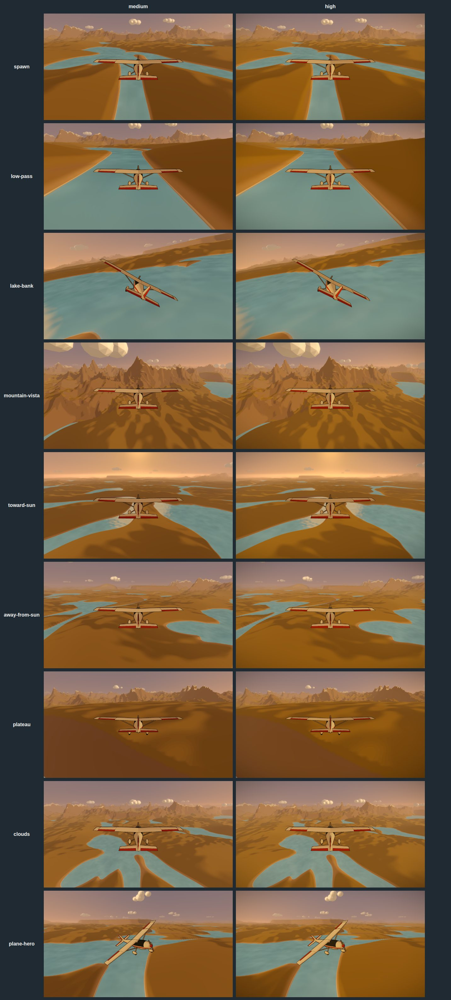

# Performance and latency

Budgets, the baseline measured before the AAA polish pass, and how to measure.
Numbers marked *cloud* were measured in a headless Linux container with
software WebGL (SwiftShader) and no camera. Frame times there are meaningless
for the phone; draw calls, triangles, tile counts and CPU-side allocation and
timing are real. Phone numbers are an owner step (see the end).

## Budgets

| Target | Budget |
|---|---|
| Phone (iPhone 13 class), `medium`, pose detection and mirroring running | 60 fps sustained; p95 frame time under 16.7 ms, p99 under 20 ms |
| Desktop, `high` | 120 fps capable |
| Per-frame heap allocations in the hot path (flight step, camera, clouds, plane rig, pose source, overlay) | Zero |
| Gesture to visible bank, phone, excluding mirroring | Under 120 ms |
| Draw calls, `medium`, in flight | Under 160 |
| Triangles, `medium`, in flight | Under 450k |

## Baseline: draw calls and triangles per bookmark (cloud, exact)

Captured by `tests/e2e/shots.spec.ts` at 1920×1080. The counts include the
composer's passes (`DisplayRenderPass` resets `renderer.info` once per frame).
They match across tiers because both run the same mipmap bloom chain and
`postprocessing` merges `high`'s warm lift, saturation and vignette into the
one final effect pass. What `high` adds is full-resolution bloom and 4× MSAA:
fill cost, not draws.

Tiles is the streamed layout. Roughly 100 of the 280 survive frustum culling and draw.

The "before" frames for every art PR, `medium` beside `high`:

| Bookmark | `medium` draws | `medium` triangles | `high` draws | `high` triangles | Tiles |
|---|---|---|---|---|---|
| `spawn` | 119 | 327k | 119 | 327k | 280 |
| `low-pass` | 119 | 327k | 119 | 327k | 280 |
| `lake-bank` | 116 | 313k | 116 | 313k | 280 |
| `mountain-vista` | 121 | 297k | 121 | 297k | 280 |
| `toward-sun` | 118 | 288k | 118 | 288k | 280 |
| `away-from-sun` | 114 | 303k | 114 | 303k | 280 |
| `plateau` | 113 | 290k | 113 | 290k | 273 |
| `clouds` | 118 | 318k | 118 | 318k | 280 |
| `plane-hero` | 112 | 266k | 112 | 266k | 280 |

Breakdown at `spawn`, `medium`: terrain tiles are one draw each, the plane is
8 at cruise (9 in a climb), sky 1, water 1, clouds 1 (one instanced mesh, 343
puffs), plus the composer's bloom chain and final effect pass.

## Baseline: hot-path allocations and CPU time (cloud, Node 22, exact)

Bytes are heap growth per call averaged over 20k calls after warm-up with
`--expose-gc`; microseconds are wall time per call. Everything in this table
runs every frame at 60 Hz except where noted.

| Path | Before B/call | After E2 (#60) B/call | CPU µs/call | Cadence |
|---|---|---|---|---|
| `flightModel.step`, 1 substep | 360 | 32 | 0.39 | per frame |
| `flightModel.step`, 2 substeps (dt 1/30) | 719 | 32 | 0.73 | long frames |
| Chase camera (desired, 2 damps, orientation, fov) | 703 | 48 | 0.55 | per frame |
| Plane rig (target and damp) | 720 | 16 | 0.73 | per frame |
| `computeAudioParams` | 106 | 0 | 0.03 | per frame |
| `heightAt` (soft floor) | noise | noise | 1.11 | per frame |
| `interpretPose` | 815 | not yet | 0.79 | per detection, 20 Hz |
| `PoseOverlay.armLine` | 596 | 0 | 0.20 | per frame |
| Clouds wrap, 343 puffs | 2521 | loop rewritten, not measured | 19.78 | per frame |
| `selectTiles` | 12645 | not yet | 94.89 | on chunk crossing only |

"After" is from `src/flight/allocations.test.ts` (60k warm-up calls, 20k
measured). The remaining 16–48 B are V8 boxing doubles stored into object
fields in optimized code, not objects the code creates; the test's ceilings
(56, 80, 32, 16, 16) catch any real regression. `interpretPose` and
`selectTiles` are follow-ups in the backlog.

Where the bytes came from before E2, from reading the code:

- `flightModel.integrate` allocates a `Vector3` (`position.clone()`), an
  `Euler` and a `Quaternion` per substep, plus the returned `FlightState` and
  two `SpringResult` objects. `step` then hands a new object to
  `useFlightStore.setState`, which builds a new store state object.
- `cameraMath`: `desiredCameraPosition` returns a new `Vector3`; `dampVector3`
  clones (twice per frame); `chaseCameraOrientation` allocates a forward
  `Vector3`, an up `Vector3`, a `Matrix4` and a `Quaternion`.
- `planeRig.targetDeflections` returns a new object per frame.
- `Clouds` recomputes every puff's wrapped position per frame through
  `forEach` closures; the matrices themselves are written in place.
- `poseSource` and `interpretPose` allocate a new gesture state, two filter
  states and a `ControlInput` per detection (20 Hz, not 60), and the input
  store spreads it into another object.
- `PoseOverlay.armLine` allocates the points array, six point objects and a
  `slice` per frame.
- `heightAt` (soft floor) is allocation-free in steady state; the number in
  the table is measurement noise from the surrounding closure.

Roughly 2–3 KB per frame at 60 Hz, about 150 KB/s, before React, R3F and
Three's own per-frame work. That is not a frame-time problem on a laptop; on a
phone that is also running MediaPipe and a screen encoder it is avoidable GC
pressure. E2 takes it to zero with scratch objects and out-parameters.

## Baseline: latency stack (analysed, to be measured by E1)

The chain from the body moving to the bank being visible on the phone screen,
with the current constants. Means, then the range.

| Stage | Where | Mean | Range | Notes |
|---|---|---|---|---|
| Camera capture and delivery | `cameraService` 640×480 @ 30 fps | ~45 ms | 30–70 ms | Sensor exposure plus the pipeline to `requestVideoFrameCallback`; unmeasured on iOS |
| Detection pacing | `poseFrame.pace`, 20 Hz | 25 ms | 0–50 ms | A frame waits up to one interval |
| Inference | MediaPipe lite, GPU delegate | ~25 ms | 15–40 ms | Phone GPU estimate; the cloud e2e shows 500 ms under software GL, which says nothing about the phone |
| Hand-off to the input store | `poseSource` polls `poseStore` on rAF | 8 ms | 0–16 ms | The detection lands between frames |
| One Euro filter | `minCutoff` 1 Hz, `beta` 0.3 | 5–40 ms | | At rest τ = 159 ms, but cutoff rises with speed: a 60°/s tilt is at 19 Hz (τ 8 ms); a slow 15°/s tilt sits at ~5 Hz (τ 30 ms) |
| Bank spring | `bankSmoothTime` 0.35 s | 300 ms to 50 % | 680 ms to 90 % | Critically damped: the first visible motion is immediate, but half the bank takes 0.3 s |
| Pitch spring | `pitchSmoothTime` 0.45 s | 380 ms to 50 % | 880 ms to 90 % | |
| Render and present | 60 Hz | 17 ms | 8–33 ms | |
| Mirroring | AirPlay / Chromecast | 100–200 ms | | Excluded from the target |

First visible response: about **125–155 ms** on the phone. Half of a commanded
bank: about **450 ms**. The pipeline itself is near the 120 ms target; what
makes the plane feel slow is the spring, not the camera. E4's levers, in order
of expected payoff:

1. Write `ControlInput` from the pose service when the detection lands
   instead of on the next rAF (−8 ms mean).
2. 30 Hz detection when inference time allows (−8 ms mean wait, and the
   filters see finer samples).
3. Predict roll and pitch forward by one detection interval with the filter's
   derivative (−25 ms perceived).
4. Bank spring 0.35 → 0.2 s with a roll-rate cap so weight comes from the
   cap, not from lag (half bank in ~170 ms).

Every constant change ships with the probe's before-and-after numbers in
`docs/decisions.md`.

## Baseline: what runs where

| Work | Thread | Rate |
|---|---|---|
| Terrain heights | 1–2 Web Workers | On chunk crossings |
| MediaPipe inference | Main thread, `requestVideoFrameCallback` | 20 Hz |
| Gesture interpretation | Main thread, rAF | Per detection |
| Flight step, camera, plane rig, clouds, water, audio params | Main thread, R3F `useFrame` | 60 Hz |
| Control machine, pause menu, HUD readouts, pose overlay | Main thread, separate rAF loops (6 of them) | 60 Hz |

Six independent `requestAnimationFrame` loops run beside R3F's. They are cheap
individually; E2 folds the per-frame ones that touch flight or input into one
tick so ordering is deterministic.

## Quality tiers and the adaptive governor (E3, #89)

The starting tier is picked at load (`qualityStore`): `high` on a fine pointer,
`medium` on a coarse one. From there the frame-time governor
(`src/render/adaptiveQuality.ts`) walks a ladder built from that starting
point, one change per rung, skipping any step that changes nothing:

| Order | What drops | Steps |
|---|---|---|
| 1 | Pixel ratio, capped at the screen's own | 1.5 → 1.25 → 1 → 0.75 |
| 2 | Post tier | `high` → `medium` → `low` |
| 3 | Foliage density (read by A3) | 100 % → 60 % → 30 % |
| 4 | View distance, with the far haze closing in first | 10 km → 7 km |

Budgets and timing:

- The target is a frame-time p95 of 16.7 ms (60 fps), measured over a rolling
  3 s window and sampled twice a second. `?budget=<ms>` overrides it for testing.
- Over budget for 3 s steps down one rung. Under 70 % of budget for 10 s steps
  up one rung.
- A rung that fails within 15 s of being climbed is blocked for 30 s, doubling
  each time it fails again, so the governor settles instead of oscillating.
- It waits 3 s after the scene mounts and 1 s after each change before
  measuring. Frames over 1 s are one-off stalls and aren't counted.
- `?fx=` pins the tier and turns the governor off. The `?shot=` captures always
  pin it.
- Pose detection steps 20 → 15 → 12 Hz when inference stays over 40 ms for
  2 s, and recovers after 10 s under 25 ms (`src/pose/detectionRate.ts`).
- The `?debug` HUD shows the rung, the last change and the view distance on
  screen.

## Measuring

- **Bookmarks:** `SHOTS=1 SHOTS_TAG=<tag> SHOTS_FX=<tier> npx playwright test tests/e2e/shots.spec.ts`
  writes `shots/<tag>/<tier>/<name>.png` and `.json` with draws,
  triangles and tiles. Use `SHOTS_ONLY=<name>` for one bookmark.
- **Allocations:** the E2 slice adds `src/flight/allocations.test.ts`, run
  with `NODE_OPTIONS=--expose-gc`, asserting zero heap growth per call.
- **Latency:** the E1 probe (`?debug`) stamps the camera frame, the pose
  result, the input write and the first frame whose bank differs, and shows
  the p50/p95 of each hop.
- **Phone (owner step, needs-human):** open the Vercel preview with `?debug`
  on the phone, cast to the TV, fly for 10 minutes, and paste the HUD numbers
  at 0, 5 and 10 minutes (fps, p95/p99 frame ms, pose Hz, inference ms, tier,
  DPR) plus heat notes into the E3 issue.
